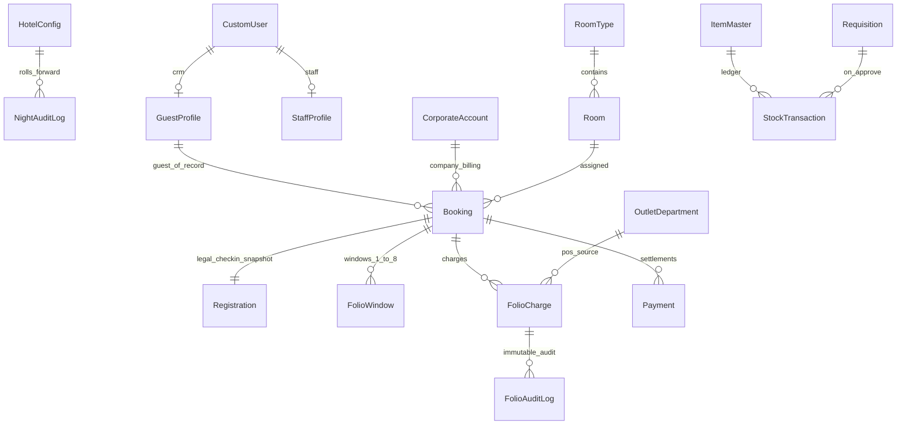

# Crown HMS — Enterprise PMS Database Architecture (OPERA-Style)

**Stack:** Django + DRF + SimpleJWT + MySQL (production)  
**Authoring role:** Senior System Architect  
**Status:** Target schema blueprint (maps to current codebase + migration path)

---

## 1. Entity-Relationship Overview



---

## 2. Revenue Guard & Business Date (Cross-Cutting Rules)

| Rule | Implementation Point |
|------|---------------------|
| **Business Date** | `HotelConfig.business_date` singleton — NEVER use `timezone.now().date()` for revenue |
| **Charge posting** | `FolioCharge.charge_date = HotelConfig.load().business_date` |
| **Payment posting** | `Payment.business_date` + `paid_at` derived from business date |
| **Checkout block** | `abs(folio_total - net_payments) > 0.01` → reject execute |
| **Void-not-Delete** | `FolioCharge.is_void=True` + reversing `FolioAuditLog` entry |
| **Night Audit** | Only process advances `business_date`; snapshot → `NightAuditLog` |

**Balance formula:**
```
folio_total   = SUM(FolioCharge.total WHERE is_void=False)
net_payments  = SUM(Payment.amount WHERE is_refund=False) - SUM(Payment.amount WHERE is_refund=True)
balance       = folio_total - net_payments
```

---

## 3. Operational Workflows

### 3.1 Reservation → Check-in (Atomic Transaction)
```
CONFIRMED → [RegistrationModule] → CHECKED_IN
  ├─ Room.status = OCCUPIED
  ├─ Registration snapshot created (immutable legal record)
  ├─ FolioWindow #1 created (up to 8)
  └─ FolioCharge ROOM posted (business_date)
```

### 3.2 POS / Outlet → Folio
```
Restaurant/Spa queries: GET in-house by room_number
  → POST FolioCharge(charge_type=FOOD|SPA, folio_window=N, outlet_ref)
```

### 3.3 Check-out (Revenue Guard)
```
balance ≈ 0 → CHECKED_OUT
  ├─ Room.status = AVAILABLE, housekeeping_status = DIRTY
  ├─ Folio settled flag on booking
  └─ PDF invoice generated
```

### 3.4 Night Audit
```
PIN verified → post room charges → snapshot KPIs → business_date += 1
```

---

## 4. Gap Analysis: Current vs Target

| Requirement | Current Crown HMS | Target Action |
|-------------|-------------------|---------------|
| Booking → GuestProfile FK | FK to CustomUser | Add `guest_profile` FK; keep user for auth |
| NO_SHOW status | Boolean `no_show` | Add `NO_SHOW` to Status choices |
| Room BLOCKED | Missing | Add `BLOCKED` status |
| HK: Clean/Dirty/Inspected | Mixed OC/OD + CLEAN/DIRTY | Unify to enterprise enum |
| CorporateCRM table | `company_name` string only | Add `CorporateAccount` model |
| Folio separate app | In `bookings` + `dashboard` | Optional `folio` app extraction |
| Outlet FK on charges | `reference` string only | Add `outlet_department` FK |
| ItemMaster naming | `Item` | Alias/rename in migration |
| Police portal export | Partial on GuestProfile | Add `police_export_fields()` method |
| Folio settled flag | Computed only | Add `folio_settled_at` on Booking |

---

## 5. Module Blueprint Files

See companion Python blueprints (reference implementation, not auto-applied):

- `docs/architecture/blueprint/accounts_models.py`
- `docs/architecture/blueprint/rooms_models.py`
- `docs/architecture/blueprint/bookings_models.py`
- `docs/architecture/blueprint/folio_models.py`
- `docs/architecture/blueprint/cms_models.py`
- `docs/architecture/blueprint/corporate_models.py`
- `docs/architecture/blueprint/config_models.py`

---

## 6. MySQL Production Notes

```python
# settings/production.py
DATABASES = {
    'default': {
        'ENGINE': 'django.db.backends.mysql',
        'NAME': env('DB_NAME'),
        'USER': env('DB_USER'),
        'PASSWORD': env('DB_PASSWORD'),
        'HOST': env('DB_HOST'),
        'OPTIONS': {'charset': 'utf8mb4', 'init_command': "SET sql_mode='STRICT_TRANS_TABLES'"},
    }
}
```

**Indexes to add:**
- `Booking(status, check_in_date, check_out_date)`
- `Booking(room_id, status)` — in-house lookup
- `FolioCharge(booking_id, folio_window, is_void)`
- `Payment(booking_id, status, is_refund)`
- `Room(room_number)` — unique, checkout lookup
- `Registration(registration_ref)` — unique

---

## 7. App Dependency Graph

```
accounts ──┬── bookings ──┬── dashboard (HotelConfig, NightAudit, FolioWindow)
           │              ├── folio (target extraction)
           │              └── corporate
rooms ─────┘
cms (headless, no FK to PMS)
inventory (standalone, FK optional to requisition department)
restaurant/spa → outlet charges → bookings.FolioCharge
```
